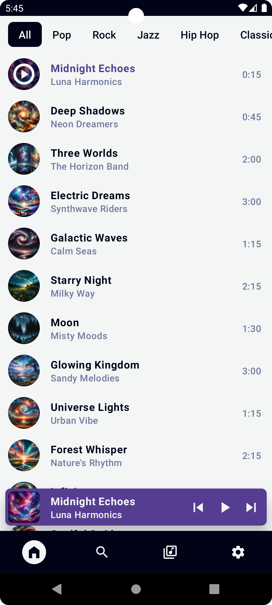
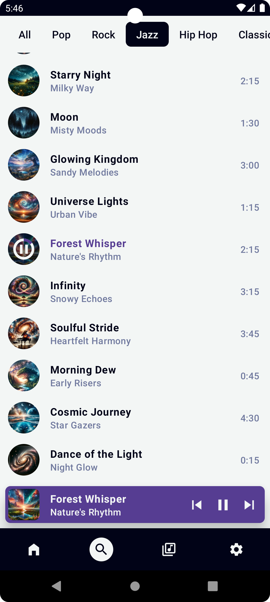

# MusicStreamingDemoApp

  
  

## Overview
The MusicStreamingDemoApp serves as an educational resource for those interested in exploring Android development with a focus on Jetpack Compose. This demonstration application simulates a music streaming platform using a clean architecture, showcasing UI elements with Jetpack Compose, image rendering with Coil, and a mock playback mechanism. Its primary goal is to provide a hands-on example for learning and understanding the principles and practices of Android Compose.

## Key Features
- **Reactive UI**: Utilizes Jetpack Compose to create a dynamic user interface that reacts to state changes instantaneously.
- **Modular Composables**: Features a UI composed of independent Composables, promoting ease of maintenance and individual testing.
- **Mock Playback**: Incorporates a fake playback system to emulate music player progress without sound output.
- **State Management**: Exhibits effective state management in Composables through the use of ViewModel and state flows.

## PlayListScreen
The `PlayListScreen` is the centerpiece of the demo app, integrating the following key Composables:
1. **LabelSelectorBar**: Engages users with a selection of categories; however, selections are currently non-functional and set for future state changes.
2. **TrackList**: Showcases a scrollable list of tracks, with state-managed interactive components.
3. **FloatingPlaybackBar**: Offers a floating playback control bar, with user interaction capabilities.
4. **BottomBar**: Presents a navigation bar with selectable items, symbolizing active sections without triggering functionality.

Together, these components form the `PlayListScreen`, providing a detailed example of a Composable-based design for a single-screen application.

## Code Structure
The application's structure revolves around `MainActivity`, which is responsible for initializing the Compose theme and content. `MainViewModel` orchestrates the data and state flows, highlighting a structured separation between the UI layer and business logic.

## Design Acknowledgement
The UI/UX design of this app is the work of Ken Ruiz Inoue (@kenruizinoue on GitHub), laying the foundation for the visual and user interaction elements of the MusicStreamingDemoApp.

## Getting Started
To start exploring this demo app:
1. Clone the repository to your machine.
2. Open the project in Android Studio Arctic Fox or later versions.
3. Deploy the app on an emulator or a physical device to explore its functionalities.
